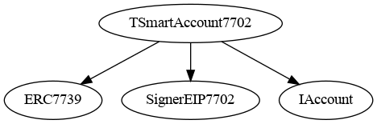
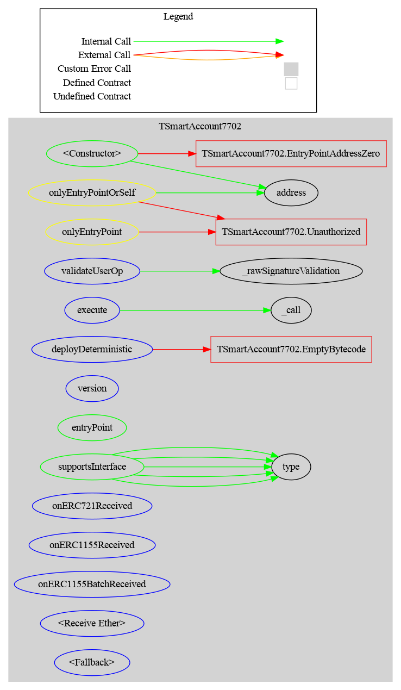

# Smart Account 7702

A minimal [ERC-4337](https://eips.ethereum.org/EIPS/eip-4337) smart account designed for [EIP-7702](https://eips.ethereum.org/EIPS/eip-7702) delegation.

## Overview

With EIP-7702, an EOA delegates its execution logic to this contract. `address(this)` inside the contract **is** the EOA address, so multi-owner management is unnecessary; the EOA's private key is the sole authority.

The contract supports:
- ERC-4337 UserOperation validation (signature recovery against `address(this)`)
- Single-call execution (`execute`)
- Deterministic contract deployment via CREATE2 (`deployDeterministic`)
- ERC-1271 signature validation with ERC-7739 anti-replay protection
- ERC-721 and ERC-1155 token reception (`onERC721Received`, `onERC1155Received`, `onERC1155BatchReceived`)
- ETH receiving (`receive`, `fallback`)

## Architecture

### Inheritance Graph



```
TSmartAccount7702
  ├── ERC7739 (OZ draft — ERC-1271 + ERC-7739 anti-replay)
  │     ├── IERC1271
  │     ├── EIP712 (domain separator, eip712Domain)
  │     └── AbstractSigner
  ├── SignerEIP7702 (OZ — _rawSignatureValidation: ecrecover == address(this))
  │     └── AbstractSigner
  └── IAccount (ERC-4337)
```

### Graphs




### EIP-712 Domain

The contract uses the EIP-712 domain name `"TSmart Account 7702"` (version `"1"`), where the "T" stands for **Taurus**, the organization behind this wallet. This name is baked into bytecode immutables at construction and cannot be changed after deployment. All off-chain signing tools, dApps, and integrators must use this exact string to produce valid ERC-1271 / ERC-7739 signatures. The `eip712Domain()` view function returns the domain parameters for programmatic discovery.

> **Warning:** The OZ `EIP712` base contract stores domain name and version as `ShortString` values. If either string is 32 bytes or longer, OpenZeppelin writes the overflow to storage fallback variables (`_nameFallback` at slot 0, `_versionFallback` at slot 1). Under EIP-7702, those writes land in the **delegating EOA's** storage, permanently overwriting slots 0 and 1. The current strings `"TSmart Account 7702"` (19 bytes) and `"1"` (1 byte) both fit within the 31-byte `ShortString` limit, so this path is never triggered. Any future version of this contract must keep both domain strings under 32 bytes.

### Access Control

| Function | Guard |
|---|---|
| `validateUserOp` | `onlyEntryPoint` |
| `execute` | `onlyEntryPointOrSelf` |
| `deployDeterministic` | `onlyEntryPointOrSelf` |

`onlyEntryPointOrSelf` allows both the EntryPoint (for UserOp execution) and the EOA itself (for direct transactions, since `msg.sender == address(this)` with 7702 delegation).

### Contract Description Table

| Function | Visibility | Mutability | Modifiers |
|---|---|---|---|
| `validateUserOp` | External | State-changing | `onlyEntryPoint` |
| `execute` | External | Payable | `onlyEntryPointOrSelf` |
| `deployDeterministic` | External | Payable | `onlyEntryPointOrSelf` |
| `entryPoint` | Public | View | — |
| `supportsInterface` | Public | View | — |
| `onERC721Received` | External | Pure | — |
| `onERC1155Received` | External | Pure | — |
| `onERC1155BatchReceived` | External | Pure | — |
| `_call` | Internal | State-changing | — |

### Token Receiver Callbacks

Under EIP-7702, the EOA has code (`address.code.length > 0`), which means ERC-721 `safeTransferFrom` and all ERC-1155 transfers invoke receiver callbacks on the wallet. Without proper callbacks, the ABI decoder fails on the empty `fallback()` return data and the transfer reverts.

This is especially critical for **ERC-1155**, which has **no** non-safe transfer function. Without `onERC1155Received`, the wallet cannot receive any ERC-1155 tokens at all.

The contract implements all three receiver callbacks:

| Callback | Returns | Standard |
|---|---|---|
| `onERC721Received` | `0x150b7a02` | ERC-721 |
| `onERC1155Received` | `0xf23a6e61` | ERC-1155 |
| `onERC1155BatchReceived` | `0xbc197c81` | ERC-1155 |

`supportsInterface` advertises `IERC721Receiver` (`0x150b7a02`) and `IERC1155Receiver` (`0x4e2312e0`).

### Custom Errors

| Error | Description |
|---|---|
| `Unauthorized(address caller)` | Caller is not the EntryPoint or the account itself |
| `EntryPointAddressZero()` | `address(0)` passed as `entryPoint_` to the constructor |
| `EmptyBytecode()` | `deployDeterministic()` called with zero-length creation code |

### Events

| Event | Emitted by |
|---|---|
| `ContractDeployed(address indexed deployed)` | `deployDeterministic()`: logs the address of the newly deployed contract |

## Delegation Model

The EntryPoint address is baked into the implementation bytecode as an immutable set at construction time. No per-EOA initialization is required after delegation:

```
1. Deploy implementation ──> constructor(entryPoint_) sets ENTRY_POINT immutable
                              and EIP-712 domain immutables (name, version) in bytecode.
                              All delegating EOAs share these values.

2. EOA signs EIP-7702 authorization tuple
   ──> EOA's code now points to the implementation bytecode.
       The account is immediately operational with no further steps.
```

Because the EntryPoint is an immutable, it is identical for every EOA that delegates to the same implementation. There is no per-EOA state to initialize, race, or misconfigure. Upgrading to a different EntryPoint requires deploying a new implementation contract and signing a new EIP-7702 authorization tuple, which is the canonical EIP-7702 upgrade path.

## Contract Deployment (CREATE2)

The wallet can deploy contracts deterministically via ERC-4337 UserOperations using the CREATE2 opcode. This is useful for deploying token contracts, proxies, or factory patterns where the wallet acts as the deployer.

### How it works

```
UserOp.callData = abi.encodeCall(TSmartAccount7702.deployDeterministic, (value, creationCode, salt))

EntryPoint → validateUserOp() → deployDeterministic() → CREATE2 opcode → new contract
```

Under EIP-7702, the deployer is `address(this)` = the EOA. So `msg.sender` in the child contract's constructor is the EOA address. The deployed address is deterministic: `keccak256(0xff ++ deployer ++ salt ++ keccak256(creationCode))`.

### Why CREATE2 only

CREATE2 addresses are fully deterministic: they depend only on the deployer address, salt, and bytecode. This makes them pre-computable and consistent across chains. CREATE addresses depend on the EVM account nonce, which is fragile and hard to track alongside the separate ERC-4337 EntryPoint nonce.

### Usage Example

```solidity
bytes memory creationCode = abi.encodePacked(
    type(MyContract).creationCode,
    abi.encode(constructorArg)
);
bytes32 salt = bytes32(uint256(0x1234));
bytes memory callData = abi.encodeCall(
    TSmartAccount7702.deployDeterministic,
    (0, creationCode, salt)
);
```

## Threat Model

This section documents the attack vectors analyzed against TSmartAccount7702 and how each is mitigated. All attacks are covered by tests in `test/AttackTests.t.sol` (v0.9) and `test/AttackTests.v08.t.sol` (v0.8).

### EntryPoint Trust

The trusted EntryPoint is set once at implementation deployment as an immutable constructor parameter. There is no on-chain initialization step after delegation, so there is no window for an attacker to interfere with EntryPoint configuration. Every EOA that delegates to the same implementation automatically trusts the same EntryPoint without any additional transaction.

### Attack: Unauthorized Execution

| Attack | Mitigation | Test |
|---|---|---|
| Random address calls `execute()` | `onlyEntryPointOrSelf` reverts | `test_attack_unauthorizedExecute_reverts` |
| Random address calls `deployDeterministic()` | `onlyEntryPointOrSelf` reverts | `test_attack_unauthorizedDeployDeterministic_reverts` |

The `onlyEntryPointOrSelf` modifier ensures only two callers are allowed:
- The trusted EntryPoint (baked in as `ENTRY_POINT` immutable)
- The EOA itself (`msg.sender == address(this)`, for direct transactions)

### Attack: ETH and Token Theft

| Attack | Mitigation | Test |
|---|---|---|
| Drain ETH via `execute(attacker, balance, "")` | `onlyEntryPointOrSelf` blocks unauthorized callers | `test_attack_stealEther_reverts` |
| Drain ERC-20 via `execute(token, 0, transfer(...))` | Same access control | `test_attack_stealTokens_reverts` |

Even if the attacker knows the exact calldata needed to drain the account, they cannot invoke `execute()` because only the EntryPoint or the EOA itself is authorized.

### Attack: Signature Attacks

| Attack | Mitigation | Test |
|---|---|---|
| UserOp signed by wrong private key | `_rawSignatureValidation` returns `false`, `validateUserOp` returns 1 (SIG_VALIDATION_FAILED) | `test_attack_wrongSignerUserOp_fails` |
| Replay a valid UserOp (same nonce) | EntryPoint nonce system rejects duplicate nonces | `test_attack_replayUserOp_reverts` |
| Replay ERC-1271 signature on different account | ERC-7739 domain separator includes `address(this)`, so signature is invalid on any other account | `test_attack_erc1271CrossAccountReplay_rejected` |
| Call `validateUserOp` directly (not via EntryPoint) | `onlyEntryPoint` modifier reverts | `test_attack_validateUserOpFromNonEntryPoint_reverts` |

Signature security relies on three layers:
1. **ECDSA recovery**: `ecrecover(hash, sig) == address(this)`, meaning only the EOA's private key can produce valid signatures
2. **EntryPoint nonce**: Each UserOp must carry a fresh nonce from the EntryPoint's nonce mapping, preventing replay
3. **ERC-7739 domain binding**: ERC-1271 signatures include the account address in the EIP-712 domain separator, preventing cross-account replay

### Residual Risks

These risks are inherent to the EIP-7702 model and cannot be mitigated at the smart contract level:

| Risk | Description |
|---|---|
| **Private key compromise** | If the EOA's private key is stolen, the attacker has full control. There is no multi-sig, guardian, or social recovery. By design, the EOA key is the sole authority. |
| **Re-delegation to malicious implementation** | The EOA can re-delegate to any contract via EIP-7702. If the owner is tricked into signing an authorization tuple pointing to a malicious implementation, the new code could drain the account. |

## Design Decisions

### Dual Gas Model (Paymaster or Self-Funded)

The account supports both gas payment modes:

- **With paymaster**: A paymaster (e.g. the [Circle USDC Paymaster](https://developers.circle.com/paymaster)) sponsors gas. `missingAccountFunds` is `0` and no ETH is needed from the account.
- **Self-funded**: When no paymaster is attached, `validateUserOp` pays `missingAccountFunds` to the EntryPoint from the account's ETH balance. The EOA must hold sufficient ETH to cover gas.

This ensures the wallet remains functional even if a paymaster goes offline or is discontinued.

### No UUPS Proxy

Traditional smart accounts use UUPS proxies for upgradeability. This account does not, because EIP-7702 provides a native upgrade mechanism:

- The EOA can re-delegate to a **new implementation** at any time by signing a new EIP-7702 authorization tuple `(chainId, address, nonce)`
- This is simpler and cheaper than UUPS proxy upgrades
- No proxy storage slots or `delegatecall` indirection is needed
- The EOA retains full control over which implementation it delegates to

### No Multi-Owner / Factory

With EIP-7702, the EOA *is* the wallet. There is no need for:

- **Multi-owner management**: The EOA's private key is the sole signer. `validateUserOp` verifies `ecrecover(userOpHash, signature) == address(this)`.
- **Factory**: No proxy deployment is needed. Each EOA delegates directly to the deployed implementation contract.

### Immutable EntryPoint

The EntryPoint address is set once at implementation deployment via the constructor and baked into bytecode as an immutable. All EOAs delegating to the same implementation share the same EntryPoint. Targeting a different EntryPoint version requires deploying a new implementation with the desired address and re-delegating via a new EIP-7702 authorization tuple.

## Integration Flow

```
1. Deploy TSmartAccount7702 implementation contract (EntryPoint baked in as immutable)
2. Bob's EOA delegates to TSmartAccount7702 via EIP-7702 authorization tuple
   ──> account is immediately operational, no further setup required
3. Bob signs EIP-2612 permit for USDC → Circle Paymaster
4. UserOp submitted to bundler (e.g. Pimlico)
5. EntryPoint → validateUserOp() recovers signature == address(this) ✓
6. Circle Paymaster pays gas in USDC
7. execute() / deployDeterministic() runs the target action
```

## Ethereum API

### validateUserOp

```solidity
function validateUserOp(
    PackedUserOperation calldata userOp,
    bytes32 userOpHash,
    uint256 missingAccountFunds
) external onlyEntryPoint returns (uint256 validationData)
```

Validates the UserOperation signature. Returns `0` on success, `1` on signature failure (to support simulation). The signature should be a raw ECDSA signature (`abi.encodePacked(r, s, v)`), with no wrapper struct. If `missingAccountFunds > 0` (no paymaster), the account pays the required prefund to the EntryPoint from its ETH balance.

### execute

```solidity
function execute(address target, uint256 value, bytes calldata data)
    external payable onlyEntryPointOrSelf
```

Executes a single call from this account.

### deployDeterministic

```solidity
function deployDeterministic(uint256 value, bytes calldata creationCode, bytes32 salt)
    external payable onlyEntryPointOrSelf returns (address deployed)
```

Deploys a contract using CREATE2. The address is deterministic: `keccak256(0xff ++ deployer ++ salt ++ keccak256(creationCode))`. Reverts with `EmptyBytecode()` if `creationCode` is empty. Emits `ContractDeployed(deployed)`.

### entryPoint

```solidity
function entryPoint() public view returns (address)
```

Returns the `ENTRY_POINT` immutable set at construction time.

## Test Suite

The project has 127 tests across 28 test suites.

### Dual EntryPoint Testing

All tests that route UserOperations through the real EntryPoint are run against **two versions**:

- **EntryPoint v0.9.0**: the latest canonical release
- **EntryPoint v0.8.0**: the previous stable release

This ensures the smart account is compatible with both versions. Test logic is extracted into abstract contracts, and two concrete classes (V09, V08) inherit the same tests with different EntryPoint implementations via `UseEntryPointV09` / `UseEntryPointV08` mixins.

```bash
# Run only V08 tests
forge test --match-path "test/TSmartAccount7702/v08/*"

# Run only V09 tests (default)
forge test --match-path "test/TSmartAccount7702/*.t.sol"
```

### Unit Tests (`test/TSmartAccount7702/`)

| Test File | Coverage | V08 variant |
|---|---|---|
| `ValidateUserOp.t.sol` | Signature validation, wrong signer, non-EntryPoint caller, prefund payment | Yes |
| `Execute.t.sol` | Single call execution, access control, revert bubbling | Yes |
| `Deploy.t.sol` | CREATE2 deployment, empty bytecode, constructor revert, salt collision, value forwarding, access control, EntryPoint routing | Yes |
| `IsValidSignature.t.sol` | ERC-7739 PersonalSign path, wrong signer, invalid signature length | — |
| `TypedDataSign.t.sol` | ERC-7739 TypedDataSign path (EIP-712 Permit), wrong signer, cross-account replay | — |
| `EthReception.t.sol` | Plain ETH transfer (`receive`), ETH with data (`fallback`), zero-value calls | — |
| `ERC721Reception.t.sol` | ERC-721 reception via mint, transferFrom, safeTransferFrom, safeMint; sending via execute | Yes |
| `ERC1155Reception.t.sol` | ERC-1155 reception via safeTransferFrom, safeBatchTransferFrom, safeMint, safeMintBatch; sending via execute | Yes |
| `Fuzz.t.sol` | Fuzz tests (256 runs each) for signature validation, prefund, PersonalSign, TypedDataSign, execution, deployDeterministic, and supportsInterface | — |

### Walkthrough Tests (`test/walkthrough/`)

Step-by-step tests designed to be read as documentation. Each test logs every step with `console2.log`; run with `forge test -vvv` to see the full narrative.

| Test | Description |
|---|---|
| `WalkthroughSimple` | ERC-20 transfer via UserOp (no paymaster, gasFees=0) |
| `WalkthroughPaymaster` | ERC-20 transfer with a paymaster covering gas (realistic fees) |
| `WalkthroughDeploy` | Contract deployment via CREATE2 and deploy-then-interact |

These tests share setup and helpers via the abstract `WalkthroughBase` contract and use a `MockPaymaster` (accept-all) for the paymaster flow.

### Fuzz Tests (`test/TSmartAccount7702/Fuzz.t.sol`)

14 property-based fuzz tests (256 runs each by default) covering the core signing, execution, and deployment paths. For a detailed explanation of each fuzzed variable, input constraints, and testing methodology, see [`doc/fuzzing.md`](doc/fuzzing.md).

| Test | Property |
|---|---|
| `testFuzz_validateUserOp_validSignature` | Any `userOpHash` signed with the correct key always validates (returns 0) |
| `testFuzz_validateUserOp_wrongSigner` | Any `userOpHash` signed with a random wrong key always fails (returns 1) |
| `testFuzz_validateUserOp_garbageSignature` | Non-65-byte random data always fails signature validation |
| `testFuzz_validateUserOp_prefund` | Fuzzed `missingAccountFunds` (1–100 ETH) with independent fuzzed balance is correctly transferred; remainder stays |
| `testFuzz_validateUserOp_zeroPrefund` | Zero prefund leaves both balances unchanged regardless of account balance |
| `testFuzz_isValidSignature_personalSign_valid` | Any hash signed via PersonalSign with correct key returns the ERC-1271 magic value |
| `testFuzz_isValidSignature_personalSign_wrongSigner` | Any hash signed with a wrong key returns `0xffffffff` |
| `testFuzz_isValidSignature_garbageSignature` | Non-65-byte garbage always returns `0xffffffff` |
| `testFuzz_isValidSignature_typedDataSign_valid` | Fuzzed permit parameters through full ERC-7739 TypedDataSign encoding validate correctly |
| `testFuzz_execute_ethTransfer` | Fuzzed ETH amounts transfer correctly to fuzzed recipients |
| `testFuzz_execute_erc20Transfer` | Fuzzed ERC-20 amounts transfer correctly to fuzzed recipients |
| `testFuzz_deployDeterministic_predictedAddress` | Fuzzed salt produces deployed address matching CREATE2 prediction |
| `test_supportsInterface_knownIds` | All 5 known interface IDs return `true` |
| `testFuzz_supportsInterface_unknownId` | Random unknown interface IDs always return `false` |

To increase the number of runs:

```bash
forge test --match-contract TestFuzz --fuzz-runs 10000
```

### Deploy Script Tests (`test/script/DeployTSmartAccount7702.t.sol`)

9 tests verifying the deployment script produces a correctly configured implementation:

| Test | What it verifies |
|---|---|
| `test_salt_matchesExpectedPreimage` | Salt equals `keccak256("TSmart Account 7702 v1")` |
| `test_deploy_addressIsDeterministic` | Deployed address matches CREATE2 prediction |
| `test_implementation_entryPointZeroReverts` | Constructor reverts with `EntryPointAddressZero()` when `address(0)` is passed |
| `test_implementation_entryPointIsConstant` | `entryPoint()` returns the v0.8.0 canonical address |
| `test_implementation_supportsExpectedInterfaces` | All 5 interface IDs (ERC-165, IAccount, ERC-1271, ERC-721 Receiver, ERC-1155 Receiver) |
| `test_implementation_eip712Domain` | Domain name `"TSmart Account 7702"`, version `"1"`, correct chain/address |
| `test_implementation_hasCode` | Non-empty bytecode |
| `test_script_runsSuccessfully` | `DeployTSmartAccount7702Script.run()` completes without reverting |

### Attack Tests (`test/AttackTests.t.sol`)

7 adversarial tests that simulate attacks and pass if the attack is correctly prevented. Both EntryPoint v0.9 and v0.8 variants are tested (14 total). See [Threat Model](#threat-model) for details.

## Developing

After cloning the repo, install dependencies and run tests:

```bash
forge install
forge test
```

Run the walkthrough tests with verbose output to see the step-by-step logs:

```bash
forge test --match-path test/walkthrough -vvv
```

## Deploying

Set in your `.env`:

```bash
# `cast wallet` name
ACCOUNT=
# Node RPC URL
RPC_URL=
```

Then deploy the implementation:

```bash
# 1. Deploy the implementation (EntryPoint baked in as immutable)
forge script script/DeployTSmartAccount7702.s.sol --rpc-url $RPC_URL --account $ACCOUNT --broadcast

# 2. Each EOA delegates to the implementation via EIP-7702 authorization tuple
#    The account is immediately operational after delegation — no further steps required.
```

## Audit

A detailed diff between v0.3.0 and v1.0.0, covering all behavioral changes, security improvements, and the `supportsInterface` bug fix, is available at [`doc/DIFFv0.3.0_1.0.0.md`](doc/DIFFv0.3.0_1.0.0.md).

### ABDK

**Auditors**: [ABDK Consulting](https://abdk.consulting)
**Scope**: `TSmartAccount7702.sol` at [`v0.3.0`](https://github.com/taurushq-io/smart-wallet-7702/tree/v0.3.0), fixes verified at [`v1.0.0-rc1`](https://github.com/taurushq-io/smart-wallet-7702/tree/v1.0.0-rc1)
**Report**: [`doc/audit/abdk/ABDK Smart Account Audit report.pdf`](doc/audit/abdk/ABDK%20Smart%20Account%20Audit%20report.pdf) — Report 1.0
**Client response** (draft): [`doc/audit/abdk/taurus-reportv0.3.0-feedback.md`](doc/audit/abdk/taurus-reportv0.3.0-feedback.md)

**Result: 9 out of 11 issues fixed.**

| Severity | Found | Fixed |
|----------|-------|-------|
| Major | 1 | 1 |
| Moderate | 3 | 2 |
| Minor | 7 | 6 |

| ID | Severity | Title | Status |
|----|----------|-------|--------|
| CVF-1 | Major | Storage collision via OZ `Initializable` under EIP-7702 delegation | Fixed: EntryPoint moved to immutable constructor parameter, initialization removed entirely |
| CVF-2 | Moderate | `onlyEntryPoint` / `onlyEntryPointOrSelf` modifiers lack initialization check | Fixed: superseded by CVF-1 fix (no uninitialized state exists) |
| CVF-3 | Moderate | Inaccurate NatSpec on `_call` ("without copying to memory") | Fixed: comment corrected |
| CVF-4 | Moderate | `_call` silently drops return data from nested calls | Acknowledged: intentional for ERC-4337 EntryPoint compatibility; `execute` is `virtual` |
| CVF-5 | Moderate | Raw revert forwarding obscures error origin | Rejected: wrapping would break ERC-4337 bundlers and off-chain tooling |
| CVF-6 | Minor | Exact compiler version pragma (`0.8.34`) | Fixed: relaxed to `^0.8.34` |
| CVF-7 | Minor | `IAccount` / `PackedUserOperation` interfaces not reviewed | Acknowledged: out of scope; from audited upstream account-abstraction v0.9.0 |
| CVF-8 | Minor | Custom errors lack parameters | Fixed: `Unauthorized()` → `Unauthorized(address caller)` |
| CVF-9 | Minor | Hardcoded ERC-7201 storage slot instead of expression | Obsolete: entire storage system removed by CVF-1 fix |
| CVF-10 | Minor | Empty `receive()` / `fallback()` blocks lack inline comments | Fixed: `// Intentionally empty:` comments added |
| CVF-11 | Minor | Version string hardcoded instead of named constant | Fixed: `string private constant VERSION` introduced |
| CVF-12 | Minor | `supportsInterface` uses raw `bytes4` magic literals | Fixed: replaced with `type(...).interfaceId` and `.selector` expressions |

A full diff of all changes between v0.3.0 and v1.0.0 is documented in [`doc/DIFFv0.3.0_1.0.0.md`](doc/DIFFv0.3.0_1.0.0.md).

### Tools

#### Aderyn

Static analysis was performed using [Aderyn](https://github.com/Cyfrin/aderyn), a Rust-based Solidity static analyzer by Cyfrin.

- [Raw report](doc/audit/tool/aderyn/aderyn-report.md): 1 high, 3 low findings
- [Feedback](doc/audit/tool/aderyn/aderyn-report-feedback.md): analysis and verdict for each finding

| Finding | Verdict |
|---|---|
| **H-1**: Contract locks Ether without a withdraw function | False positive: EIP-7702 account; EOA withdraws via `execute()` or direct transactions |
| **L-1**: Unspecific Solidity Pragma (`^0.8.34`) | Acknowledged: intentional, `^0.8.34` is the CVF-6 fix |
| **L-2**: PUSH0 Opcode | Not applicable: Prague EVM is required for EIP-7702; PUSH0 is supported |
| **L-3**: Modifier invoked only once (`onlyEntryPoint`) | Acknowledged: intentional separation from `onlyEntryPointOrSelf` |

Compared to v0.3.0: **"Literal Instead of Constant"**, **"Unused state variable" (`ENTRY_POINT_STORAGE_LOCATION`)**, and **"Empty `require()` statement"** are no longer reported. Two new findings appear: **L-1** from the CVF-6 pragma fix and **L-2** from the Prague EVM target.

#### Slither

Static analysis was also performed using [Slither](https://github.com/crytic/slither), a Python-based Solidity and Vyper static analysis framework by Trail of Bits.

- [Raw report](doc/audit/tool/slither/slither-report.md): 0 high/medium/low, 4 informational
- [Feedback](doc/audit/tool/slither/slither-report-feedback.md): analysis for each finding

| Finding | Count | Verdict |
|---|---|---|
| **Assembly usage** (Informational) | 3 instances | Acknowledged: all assembly is intentional: `_call` (revert bubbling), `validateUserOp` (ETH transfer), `deployDeterministic` (CREATE2) |
| **Naming convention** (Informational) | 1 instance | Acknowledged: `ENTRY_POINT` is an immutable; UPPER_SNAKE_CASE is correct and conventional |

Compared to v0.3.0: the `_getEntryPointStorage` assembly finding is gone (function removed with the storage system). A new naming-convention finding appears for `ENTRY_POINT` (immutable added in place of storage). No high, medium, or low severity issues were detected.

## FAQ

### Why not use `IAccountExecute`?

ERC-4337 defines an optional `IAccountExecute` interface where the EntryPoint calls `account.executeUserOp(userOp, userOpHash)` instead of `account.call(userOp.callData)`. This wallet uses direct `callData` dispatch instead for three reasons:

1. **It does not eliminate existing functions.** `executeUserOp` is only called by the EntryPoint. For direct EOA transactions (`msg.sender == address(this)`), `deployDeterministic` is still needed because regular transactions use the CALL opcode; CREATE2 requires contract code execution. Adopting `executeUserOp` would add a function while still keeping `deployDeterministic`.

2. **Extra indirection with no benefit.** This wallet does not need UserOp fields at execution time; it only needs the target, value, and data, which are already encoded in `callData`. Most `executeUserOp` implementations end up doing `address(this).call(userOp.callData[4:])`, adding a call frame and gas overhead for nothing.

3. **It is designed for more complex accounts.** `executeUserOp` is useful for session keys (enforcing gas/spending caps from UserOp parameters), spending policies (inspecting paymaster data), ERC-7579 modular accounts, or custom callData encodings. None of these apply to a minimal single-owner wallet.

| Aspect | Direct `callData` (current) | `executeUserOp` |
|---|---|---|
| EntryPoint calls | `account.call(userOp.callData)` | `account.executeUserOp(userOp, hash)` |
| Simplicity | Simple: function called directly | Must parse `callData` internally |
| Gas | No overhead | Extra call frame + calldata copying |
| UserOp access at execution | Not available | Full UserOp + hash available |
| Use case fit | Minimal single-owner wallet | Modular accounts, session keys |

### Where is the destination in a `PackedUserOperation`?

There is **no explicit destination field**. The `sender` is the account (smart wallet), not the call target, and there is no `to` field.

The destination lives inside `callData`, encoded as a function argument:

```solidity
userOp.callData = abi.encodeCall(TSmartAccount7702.execute, (
    0xRecipient,  // ← destination (target)
    1 ether,      // ← value
    ""            // ← call data
));
```

This is by design in ERC-4337: the EntryPoint only knows about the account (`sender`). How the account interprets `callData`, including which contract to call, is entirely up to the account's implementation.

### How does the EntryPoint call `execute`?

The EntryPoint treats the account as a black box. During execution, it performs a raw `call` with whatever bytes the user put in `userOp.callData`:

```
1. Bundler → EntryPoint.handleOps([userOp])
2. EntryPoint → account.validateUserOp(userOp, hash, prefund)   // validation phase
3. EntryPoint → account.call(userOp.callData)                   // execution phase
```

The user (or SDK) encodes the desired function into `userOp.callData`:

```solidity
// Single call
userOp.callData = abi.encodeCall(TSmartAccount7702.execute, (target, value, data));

// Deterministic contract deployment
userOp.callData = abi.encodeCall(TSmartAccount7702.deployDeterministic, (0, creationCode, salt));
```

The ABI-encoded bytes resolve to the function selector, and the EVM dispatches to the right function. The `onlyEntryPointOrSelf` modifier passes because `msg.sender == entryPoint()`.

Two callers are allowed:

| Caller | How | `msg.sender` |
|---|---|---|
| EntryPoint | Via `handleOps` → `userOp.callData` | `entryPoint()` address |
| EOA itself | Direct type-4 (EIP-7702) transaction with `to = self` | `address(this)` |

## References

Based on [Coinbase Smart Wallet](https://github.com/coinbase/smart-wallet), with code originally from Solady's [ERC4337](https://github.com/Vectorized/solady/blob/main/src/accounts/ERC4337.sol). Also influenced by [DaimoAccount](https://github.com/daimo-eth/daimo/blob/master/packages/contract/src/DaimoAccount.sol) and [LightAccount](https://github.com/alchemyplatform/light-account).

## Intellectual property

This code is copyright (c) 2026 Taurus SA and is licensed under the MIT License.
